# 📤 Telegram File Sender Bot

<div align="center">

### 🤖 **[@FileStoreDownloaderBot](https://t.me/FileStoreDownloaderBot)**

A feature-rich Telegram bot for storing, sharing, and managing files with advanced features like password protection, expiry control, batch uploads, and subscription management.

---


[](https://github.com/Faizan-Khanx)
[](https://github.com/Faizan-Khanx)

</div>

---

## 📑 Table of Contents

- [🌟 Key Features](#-key-features)
  - [📂 File Management](#-file-management)
  - [🔒 Security Features](#-security-features)
  - [💎 Premium Features](#-premium-features)
  - [📊 Advanced Features](#-advanced-features)
- [🏗️ High-Level Design (HLD)](#️-high-level-design-hld)
- [🔧 Low-Level Design (LLD)](#-low-level-design-lld)
  - [Database Schema](#database-schema)
  - [How File Storage Works](#-how-file-storage-works---the-secret-to-unlimited-storage)
- [📐 System Flow Diagrams](#-system-flow-diagrams)
- [🔑 Key Algorithms](#-key-algorithms)
- [🔄 State Management](#-state-management)
- [🎯 API Endpoints](#-api-endpoints-bot-commands)
- [📊 Analytics & Monitoring](#-analytics--monitoring)
- [🔐 Security Features](#-security-features-1)
- [🐛 Troubleshooting](#-troubleshooting)
- [📈 Scaling Strategy](#-scaling-strategy)
- [🤝 Contributing](#-contributing)
- [📄 License](#-license)
- [👨‍💻 Author](#-author)
- [🙏 Acknowledgments](#-acknowledgments)
- [📞 Support](#-support)
- [🎯 Roadmap](#-roadmap)

---

## 🌟 Key Features

### 📂 File Management
- **Multi-format Support**: Videos, images, documents, audio, archives, zip, rar etc.
- **File Size**: Up to 4GB per file (configurable)
- **Storage**: Files stored on Telegram servers (no local storage needed)
- **Batch Upload**: Upload up to 50 files simultaneously (unlimited for premium users)
- **Smart Deduplication**: Prevents duplicate files in batch uploads

### 🔒 Security Features
- **Password Protection**: Optional password protection for files
- **Expiry Control**: Auto-delete files after specified days (1-90 days or permanent)
- **Download Limits**: Set view limits (1, 5, 10... views or unlimited)
- **Force Subscription**: Require channel subscription before downloads

### 💎 Premium Features
- **Subscription Plans**: Monthly/Yearly plans with extended storage
- **Referral System**: Earn 2GB per referral
- **Storage Bonuses**: Base 20GB + referral bonuses + signup bonuses
- **Custom Limits**: Admin can set custom storage/expiry per user

### 📊 Advanced Features
- **Real-time Statistics**: User growth, storage usage, activity charts
- **Admin Panel**: User management, plan creation, broadcast messages
- **Backup System**: Automatic backup to log channel
- **Queue Management**: Concurrent upload/download queue system
- **Gift Codes**: Generate redeemable storage gift codes

---

## 🏗️ High-Level Design (HLD)

### 📊 System Workflow - Complete User Journey

This visual diagram shows how data flows through the entire system, from user interaction to file storage and retrieval.

```mermaid
graph TB
    %% Styling
    classDef userClass fill:#e1f5ff,stroke:#01579b,stroke-width:3px,color:#000
    classDef botClass fill:#fff3e0,stroke:#e65100,stroke-width:2px,color:#000
    classDef processClass fill:#f3e5f5,stroke:#4a148c,stroke-width:2px,color:#000
    classDef storageClass fill:#e8f5e9,stroke:#1b5e20,stroke-width:2px,color:#000
    classDef securityClass fill:#ffebee,stroke:#b71c1c,stroke-width:2px,color:#000
    
    %% User Entry Point
    START([👤 User Opens Bot]):::userClass
    
    %% Security Layer
    START --> AUTH{🔒 Force Subscribe<br/>Check}:::securityClass
    AUTH -->|Not Subscribed| BLOCK[❌ Show Subscribe<br/>Button]:::securityClass
    AUTH -->|Subscribed ✅| MENU
    BLOCK --> AUTH
    
    %% Main Menu
    MENU[📱 Main Menu<br/>Upload • My Files<br/>Plans • Referral]:::botClass
    
    %% Upload Flow
    MENU -->|Upload| UPLOAD[📤 Upload Handler<br/>State: waiting_for_file]:::processClass
    UPLOAD --> RECEIVE[📥 Receive File<br/>Extract: name, size, type]:::processClass
    RECEIVE --> VALIDATE{✅ Validation<br/>Size OK?<br/>Quota OK?}:::processClass
    
    VALIDATE -->|Failed| ERROR1[❌ Show Error<br/>Delete some files]:::securityClass
    VALIDATE -->|Passed| TELEGRAM[☁️ Send to<br/>Telegram Servers]:::storageClass
    
    TELEGRAM --> FILEID[🎫 Get telegram_file_id<br/>AgACAgIAAxk...]:::storageClass
    FILEID --> PASSWORD{🔐 Password?}:::processClass
    
    PASSWORD -->|Yes| HASH[🔒 Bcrypt Hash<br/>Store hash + plain]:::securityClass
    PASSWORD -->|No| EXPIRY
    HASH --> EXPIRY
    
    EXPIRY[⏰ Set Expiry<br/>1-90 days or ♾️]:::processClass
    EXPIRY --> LIMIT[👁️ Download Limit<br/>1-1000 or ♾️]:::processClass
    
    LIMIT --> SAVEDB[(💾 Save to MySQL<br/>file_id, telegram_file_id<br/>metadata ONLY)]:::storageClass
    
    SAVEDB --> BACKUP[📋 Backup to<br/>Log Channel]:::storageClass
    BACKUP --> LINK[🔗 Generate<br/>Share Link]:::processClass
    LINK --> DONE1[✅ Upload Complete<br/>Show Link to User]:::userClass
    
    %% Download Flow
    MENU -->|Download Link| DSTART[🔗 User Clicks<br/>Share Link]:::userClass
    DSTART --> DAUTH{🔒 Subscribed?}:::securityClass
    DAUTH -->|No| BLOCK
    DAUTH -->|Yes| FETCH[(🔍 Fetch from DB<br/>Get telegram_file_id)]:::storageClass
    
    FETCH --> DCHECK{❓ File Status}:::processClass
    DCHECK -->|Expired| DEL1[🗑️ Auto Delete<br/>Show Expired]:::securityClass
    DCHECK -->|Active| DPASS{🔐 Password?}:::processClass
    
    DPASS -->|Yes| ASKPASS[🔑 Ask Password]:::securityClass
    DPASS -->|No| DLIMIT
    ASKPASS --> VERIFY{✅ Correct?}:::securityClass
    VERIFY -->|No| ASKPASS
    VERIFY -->|Yes| DLIMIT
    
    DLIMIT{📊 Download Limit<br/>Reached?}:::processClass
    DLIMIT -->|Yes| DEL2[🗑️ Delete File<br/>Limit Reached]:::securityClass
    DLIMIT -->|No| SEND[📤 Send File<br/>from Telegram]:::storageClass
    
    SEND --> COUNT[➕ Increment<br/>Download Count]:::processClass
    COUNT --> DONE2[✅ File Sent<br/>to User]:::userClass
    
    %% Admin Flow
    MENU -->|Admin Panel| ADMIN{👑 Is Admin?}:::securityClass
    ADMIN -->|No| ERROR2[❌ Access Denied]:::securityClass
    ADMIN -->|Yes| APANEL[⚙️ Admin Panel<br/>Stats • Users<br/>Plans • Broadcast]:::processClass
    
    APANEL --> STATS[📊 View Stats<br/>Users, Files, Storage]:::processClass
    APANEL --> MANAGE[👥 Manage Users<br/>Ban, Set Limits, Gift]:::processClass
    APANEL --> PLANS[💎 Create Plans<br/>Monthly, Yearly]:::processClass
    
    %% Referral Flow
    MENU -->|Referral| REFLINK[🔗 Show Referral<br/>Link + Stats]:::processClass
    REFLINK --> NEWUSER[👤 New User Joins<br/>via Link]:::userClass
    NEWUSER --> BONUS1[🎁 Referrer Gets<br/>+2GB Bonus]:::processClass
    BONUS1 --> BONUS2[🎁 New User Gets<br/>+3GB Signup Bonus]:::processClass
    
    %% Background Tasks
    SCHEDULE[⏰ Background<br/>Scheduler]:::processClass
    SCHEDULE -->|Every Hour| CLEANUP[🧹 Delete Expired<br/>Files Auto]:::processClass
    SCHEDULE -->|Daily| REPORT[📊 Generate<br/>Statistics]:::processClass
    
    %% Storage Explanation
    STORAGE[💾 STORAGE LAYER]:::storageClass
    STORAGE -.->|Metadata Only<br/>~500 bytes/file| SAVEDB
    STORAGE -.->|Actual Files<br/>FREE ♾️| TELEGRAM
    
    %% Legend
    LEGEND1[🔵 User Interaction]:::userClass
    LEGEND2[🟠 Bot Processing]:::botClass
    LEGEND3[🟣 Business Logic]:::processClass
    LEGEND4[🟢 Storage Layer]:::storageClass
    LEGEND5[🔴 Security Check]:::securityClass
```



### 🎯 Key System Features Shown Above

#### 1️⃣ **Security First**
- Force subscription check at every entry
- Password protection with bcrypt
- Admin-only access control
- Download limit enforcement

#### 2️⃣ **Smart Storage**
- Files go directly to Telegram (NOT our server)
- We store only metadata (~500 bytes per file)
- Unlimited storage capacity
- Automatic backup to log channel

#### 3️⃣ **User Experience**
- Simple upload process with states
- Password optional
- Flexible expiry (1-90 days or permanent)
- Download limits for "snap-destroy" sharing

#### 4️⃣ **Automation**
- Background cleanup of expired files
- Auto-delete after download limit
- Scheduled statistics generation

#### 5️⃣ **Monetization**
- Referral system (2GB per referral)
- Subscription plans
- Admin panel for management

---

### 🗂️ System Components Breakdown

#### Core Handlers (Application Logic)

| Handler | Purpose | Key Features |
|---------|---------|--------------|
| **start.py** | Welcome & Menu | Main menu, help, commands |
| **upload.py** | File Upload (1264 lines) | Single + batch uploads, password, expiry |
| **download.py** | File Retrieval | Password verification, limit checks |
| **myfiles.py** | File Management | List, delete, view files |
| **admin.py** | Admin Panel (82KB) | User management, stats, broadcast |
| **subscription.py** | Plans & Payments | UPI payments, plan activation |
| **referral.py** | Referral System | Link generation, bonus tracking |

#### Data Storage Architecture

```
┌─────────────────────────────────────────────┐
│  MySQL Database (Our Server)               │
│  ✓ User data (ID, name, storage used)      │
│  ✓ File metadata (name, size, link)        │
│  ✓ telegram_file_id (just the ID!)         │
│  ✓ Subscriptions, plans, referrals         │
│  Total per file: ~500 bytes                │
└─────────────────────────────────────────────┘
                    ↕️
┌─────────────────────────────────────────────┐
│  Telegram Cloud (Telegram's Servers)       │
│  ✓ Actual files (4GB videos, etc.)         │
│  ✓ FREE unlimited storage                  │
│  ✓ Global CDN (fast everywhere)            │
│  ✓ 99.9% uptime guaranteed                 │
└─────────────────────────────────────────────┘
```

#### Business Logic Layer

- **Storage Calculator**: Base (20GB) + Plan + Referral + Signup + Admin bonuses
- **Expiry Manager**: Schedule deletion, check expired files
- **Password System**: Bcrypt hashing, verification
- **Download Tracker**: Increment count, check limits
- **Quota Enforcer**: Prevent uploads if limit exceeded

---

## 🔧 Low-Level Design (LLD)

### Database Schema

#### Users Table
```sql
users (
    user_id BIGINT PRIMARY KEY,
    username VARCHAR(255),
    first_name VARCHAR(255),
    join_date TIMESTAMP,
    is_banned TINYINT,
    total_storage_used BIGINT,
    custom_storage_limit BIGINT,
    custom_expiry_days INT,
    referral_code VARCHAR(255) UNIQUE,
    referred_by BIGINT,
    referral_bonus_storage BIGINT,
    signup_bonus_storage BIGINT,
    admin_bonus_storage BIGINT
)
```

#### Files Table
```sql
files (
    id INT PRIMARY KEY AUTO_INCREMENT,
    file_id VARCHAR(255) UNIQUE,
    user_id BIGINT,
    file_name TEXT,
    file_size BIGINT,
    file_path TEXT,
    telegram_file_id VARCHAR(255),
    unique_link VARCHAR(255) UNIQUE,
    password_hash TEXT,
    password_plain TEXT,
    upload_date TIMESTAMP,
    expiry_date TIMESTAMP,
    download_count INT,
    max_downloads INT,
    backup_message_id BIGINT,
    batch_id INT,
    FOREIGN KEY (user_id) REFERENCES users(user_id)
)
```

#### Subscriptions Table
```sql
subscriptions (
    subscription_id INT PRIMARY KEY AUTO_INCREMENT,
    user_id BIGINT,
    plan_id INT,
    start_date TIMESTAMP,
    end_date TIMESTAMP,
    is_active TINYINT,
    FOREIGN KEY (user_id) REFERENCES users(user_id),
    FOREIGN KEY (plan_id) REFERENCES plans(plan_id)
)
```

[See `database.py` for complete schema including plans, batches, gift_codes, referrals, etc.]

---

### 🎯 How File Storage Works - The Secret to Unlimited Storage

#### 💡 **Why Unlimited Storage?**

**We DON'T store ANY files on our server!** This is the key to offering unlimited storage. Your files go **directly to Telegram's servers**, and we simply act as a smart retrieval system.

```
Traditional File Storage (LIMITED):
User File → Your Server → Your Hard Disk ❌
Problem: Your server runs out of space!

Our Approach (UNLIMITED):
User File → Telegram Servers → Telegram Cloud ✅
Solution: Unlimited Telegram infrastructure!
```

#### 🔑 The File ID System Explained

When you upload a file, here's what actually happens:

```mermaid
sequenceDiagram
    participant U as User
    participant B as Our Bot
    participant TG as Telegram Servers
    participant DB as Our Database
    
    U->>B: 📤 Uploads File (e.g., video.mp4)
    B->>TG: Forward to Telegram
    TG->>TG: Store File Forever
    TG->>B: Here's your file_id: "AgACAgIAAxk..."
    B->>DB: Save ONLY metadata<br/>(file_id, size, name)
    B->>U: ✅ File stored! Here's your link
    
    Note over TG: File lives here permanently<br/>NOT on our server!
    Note over DB: We only store 1KB metadata<br/>NOT the actual file!
```



#### 📊 Storage Comparison

| What We Store | Size | Location |
|---------------|------|----------|
| Your 4GB Video | **0 bytes** | ❌ Not on our server |
| Metadata (name, size, link) | **~500 bytes** | ✅ Our database |
| Telegram file_id | **~100 bytes** | ✅ Our database |
| **Total on our server** | **~600 bytes** | **Per file!** |

**Your 4GB file?** → Stored on Telegram's servers (FREE!)

#### 💻 Code Example

```python
# ❌ WRONG WAY (traditional bots) - Limited Storage
file = await bot.download_file(file_id)
with open(f"/server/files/{filename}", "wb") as f:
    f.write(file)  # File saved on YOUR server = SPACE USED!

# ✅ OUR WAY - Unlimited Storage
telegram_file_id = message.document.file_id  # Just get the ID
file_path = f"telegram://{telegram_file_id}"  # Virtual path

# Store ONLY metadata in database (few bytes)
await db.add_file({
    'file_id': generate_unique_id(),      # Our unique ID (8 chars)
    'telegram_file_id': telegram_file_id, # Telegram's permanent ID
    'file_path': file_path,               # Virtual path (not real!)
    'file_name': 'video.mp4',             # Just the name
    'file_size': 4294967296,              # Just the number
    'user_id': user_id,
    # Total storage: ~500 bytes instead of 4GB!
})
```

#### 🔄 File Retrieval Process

```python
# When user clicks download link:
file_info = await db.get_file_by_link(unique_link)
telegram_file_id = file_info['telegram_file_id']

# Send directly from Telegram's servers (NOT ours!)
await bot.send_document(chat_id, telegram_file_id)
# Telegram streams the file directly to user
# Our server: 0 bandwidth used for file transfer!
```

#### 🚀 Why This Approach is Revolutionary

| Feature | Traditional Bots | Our Bot |
|---------|-----------------|---------|
| **Storage Limit** | Your server size (100GB?) | ♾️ Unlimited (Telegram's infrastructure) |
| **Our Server Space** | Full file size (4GB per file) | ~600 bytes metadata per file |
| **Download Speed** | Your server bandwidth | 🚀 Telegram CDN (super fast globally) |
| **Reliability** | If your server crashes = data lost | ✅ Telegram servers (99.9% uptime) |
| **Storage Cost** | $$$$ (Need to buy more space) | 💰 FREE (Telegram handles it) |
| **File Safety** | Your responsibility | 🛡️ Telegram's advanced infrastructure |

#### 📦 Real Example

If 1000 users upload 1GB files each:

**Traditional Bot:**
- Server needs: 1000 × 1GB = **1TB storage** 💰💰💰
- Monthly cost: ~$50-100/month

**Our Bot:**
- Server needs: 1000 × 600 bytes = **0.6MB metadata** 🎉
- File storage: **FREE** (on Telegram)
- Monthly cost: **$0 for storage!**

#### 🔐 Backup & Recovery System

```python
# Every file is automatically backed up to log channel
await bot.send_document(LOG_CHANNEL_ID, telegram_file_id, caption=metadata)

# If our bot gets deleted:
# 1. Create new bot
# 2. Use same database
# 3. All files still work! (telegram_file_id doesn't change)
```

#### ✨ The Magic Explained

```
What happens to your file:
┌─────────────────────────────────────────────────┐
│ 1. You upload video.mp4 (4GB)                   │
│    ↓                                            │
│ 2. Goes to Telegram Servers                     │
│    ↓                                            │
│ 3. Telegram stores it permanently               │
│    ↓                                            │
│ 4. Telegram gives us ID: "AgACAgIAAxk..."      │
│    ↓                                            │
│ 5. We save ID in database (100 bytes)          │
│    ↓                                            │
│ 6. We generate share link                       │
│    ↓                                            │
│ 7. Anyone with link can download                │
│                                                 │
│ Your file location: Telegram Cloud ☁️           │
│ Our server storage used: 0 bytes! 🎉            │
└─────────────────────────────────────────────────┘
```

**This is how we offer UNLIMITED storage!** 🚀

---

## 📐 System Flow Diagrams

### Upload Flow


### Download Flow


### Batch Upload Flow


---

## 🗄️ Storage System Architecture

### Storage Calculation Logic

```python
# Total Storage Limit = Base + Plan + Bonuses
def calculate_total_storage(user_id):
    base_storage = 20GB  # or custom_storage_limit
    plan_storage = 0     # from active subscription
    referral_bonus = user.referral_bonus_storage
    signup_bonus = user.signup_bonus_storage
    admin_bonus = user.admin_bonus_storage
    
    return base_storage + plan_storage + referral_bonus + signup_bonus + admin_bonus
```

### File Storage States


---

## 📦 Project Structure

```
FileSenderBot/
├── bot.py                      # Main entry point
├── config.py                   # Configuration management
├── database.py                 # Database operations (1160 lines)
├── utils.py                    # Utility functions (826 lines)
├── queue_manager.py            # Upload/download queue
├── telethon_client.py          # Large file support (optional)
│
├── handlers/                   # Request handlers
│   ├── __init__.py
│   ├── start.py               # Welcome, help, menu
│   ├── upload.py              # File uploads (1264 lines)
│   ├── download.py            # File downloads
│   ├── myfiles.py             # File management
│   ├── admin.py               # Admin panel (82KB)
│   ├── subscription.py        # Payment & plans
│   ├── referral.py            # Referral system
│   ├── plan_management.py     # Plan CRUD
│   └── report.py              # Issue reporting
│
├── middlewares/               # Middleware layer
│   └── force_sub.py          # Subscription check
│
├── tasks/                     # Background tasks
│   ├── __init__.py
│   └── cleanup.py            # Expired file cleanup
│
└── data/                      # Runtime data
    ├── database.db           # SQLite fallback
    ├── qr_codes/             # UPI QR codes
    └── logs/                 # Error logs
```

---

## 🔑 Key Algorithms

### 1. Unique Link Generation

```python
def generate_unique_id(length=8):
    """Generate cryptographically secure unique ID"""
    return secrets.token_urlsafe(length)[:length]

# Example: "aB3dEf8H"
```

### 2. Password Hashing

```python
def hash_password(password: str) -> str:
    """Bcrypt password hashing"""
    salt = bcrypt.gensalt()
    hashed = bcrypt.hashpw(password.encode('utf-8'), salt)
    return hashed.decode('utf-8')

def verify_password(password: str, hashed: str) -> bool:
    return bcrypt.checkpw(password.encode('utf-8'), hashed.encode('utf-8'))
```

### 3. Expiry Calculation

```python
def calculate_expiry_date(days: int) -> datetime:
    """Calculate future expiry date"""
    if days is None or days == 0:
        return None  # Never expires
    return datetime.now() + timedelta(days=days)

def is_expired(expiry_date: datetime) -> bool:
    """Check if file has expired"""
    if expiry_date is None:
        return False
    return datetime.now() > expiry_date
```

### 4. Storage Quota Check

```python
async def check_storage_quota(user_id, file_size):
    """Verify user has enough storage"""
    used = await db.get_user_storage(user_id)
    limit = await db.get_total_storage_limit(user_id)
    
    if used + file_size > limit:
        available = limit - used
        raise StorageExceededError(
            f"Need: {format_file_size(file_size)}, "
            f"Available: {format_file_size(available)}"
        )
```

---

## 🔄 State Management

### Upload State Machine

```python
class UploadStates(StatesGroup):
    waiting_for_file = State()
    waiting_for_password_choice = State()
    waiting_for_password = State()
    waiting_for_expiry = State()
    waiting_for_download_limit = State()
```

### State Flow

```
1. User clicks "Upload File"
   └─> waiting_for_file

2. User sends file
   └─> waiting_for_password_choice

3. User chooses password option
   └─> waiting_for_password (if yes)
   └─> waiting_for_expiry (if no)

4. User sets password
   └─> waiting_for_expiry

5. User chooses expiry
   └─> waiting_for_download_limit

6. User sets download limit
   └─> Process & Complete
```

---

## 🎯 API Endpoints (Bot Commands)

### User Commands
| Command | Description |
|---------|-------------|
| `/start` | Welcome & main menu |
| `/help` | Help & instructions |
| `/myfiles` | View uploaded files |
| `/stats` | Personal statistics |
| `/referral` | Referral link & earnings |
| `/plans` | View subscription plans |

### Admin Commands
| Command | Description |
|---------|-------------|
| `/admin` | Admin panel |
| `/broadcast` | Send message to all users |
| `/stats` | Global statistics |
| `/addplan` | Create subscription plan |
| `/ban <user_id>` | Ban user |
| `/unban <user_id>` | Unban user |
| `/setlimit <user_id> <GB>` | Set custom storage |
| `/gift <code> <GB>` | Create gift code |

---

## 📊 Analytics & Monitoring

### Real-time Statistics

- **User Metrics**: Total users, new signups, banned users
- **File Metrics**: Total files, storage used, downloads
- **Activity Metrics**: Uploads/day, downloads/day
- **Revenue Metrics**: Active subscriptions, pending payments

### Chart Generation

```python
# Storage Usage Pie Chart
generate_storage_chart(used_storage, total_capacity)

# User Growth Line Chart
generate_user_growth_chart(user_stats)

# Activity Bar Chart
generate_activity_chart(upload_count, download_count)
```

---

## 🔐 Security Features

### 1. Password Protection
- Bcrypt hashing with salt
- Plain password stored for user reference
- Hash verification on download

### 2. Download Limits
- View-based restrictions (1, 5, 10... views)
- Auto-delete after limit reached
- Real-time counter updates

### 3. Force Subscription
- Middleware checks channel membership
- Blocks access until subscribed
- Real-time verification

### 4. Input Sanitization
```python
def sanitize_file_name(file_name: str) -> str:
    """Prevent directory traversal"""
    file_name = os.path.basename(file_name)
    dangerous_chars = ['..', '/', '\\', '\0']
    for char in dangerous_chars:
        file_name = file_name.replace(char, '')
    return file_name
```

---

## 🧪 Testing

### Manual Testing Checklist

- [ ] Upload single file (all types)
- [ ] Upload batch files
- [ ] Download with password
- [ ] Download with expired link
- [ ] Download limit enforcement
- [ ] Storage quota enforcement
- [ ] Referral bonus application
- [ ] Subscription activation
- [ ] Admin commands

### Load Testing

```bash
# Simulate concurrent uploads
python -m locust -f tests/load_test.py
```

---

## 🐛 Troubleshooting

### Common Issues

#### 1. **File not sending**
```
Error: "Can't parse entities"
Solution: Check caption formatting, ensure plain text mode for videos
```

#### 2. **Storage calculation wrong**
```
Issue: User shows 5GB instead of dynamic limit
Solution: Use db.get_total_storage_limit() not hardcoded value
```

#### 3. **Batch upload stuck**
```
Issue: Files not appearing after "Done"
Solution: Check state locks, ensure batch_token generation
```

#### 4. **Database connection lost**
```
Error: "Lost connection to MySQL server"
Solution: Enable connection pooling, set pool_recycle=3600
```

---

## 🚀 Performance Optimization

### 1. Database Indexing
```sql
CREATE INDEX idx_user_id ON files(user_id);
CREATE INDEX idx_unique_link ON files(unique_link);
CREATE INDEX idx_telegram_file_id ON files(telegram_file_id);
CREATE INDEX idx_expiry ON files(expiry_date);
```

### 2. Connection Pooling
```python
pool = await aiomysql.create_pool(
    host=DB_HOST,
    user=DB_USER,
    password=DB_PASS,
    db=DB_NAME,
    pool_recycle=3600,  # Recycle connections every hour
    maxsize=10
)
```

### 3. Queue Management
```python
# Limit concurrent operations
MAX_CONCURRENT_UPLOADS = 3
MAX_CONCURRENT_DOWNLOADS = 5
```

### 4. Caching
```python
# Cache user storage limits
@lru_cache(maxsize=1000)
async def get_user_limit_cached(user_id):
    return await db.get_total_storage_limit(user_id)
```

---

## 📈 Scaling Strategy

### Horizontal Scaling


### Vertical Scaling

- **Database**: MySQL → PostgreSQL for better concurrency
- **Storage**: Add Redis for session caching
- **Queue**: RabbitMQ/Celery for background tasks

---

## 🤝 Contributing

We welcome contributions! Please follow these steps:

1. Fork the repository
2. Create feature branch (`git checkout -b feature/AmazingFeature`)
3. Commit changes (`git commit -m 'Add AmazingFeature'`)
4. Push to branch (`git push origin feature/AmazingFeature`)
5. Open Pull Request

---

## 📄 License

This project is licensed under the MIT License - see the [LICENSE](LICENSE) file for details.

---

## 👨‍💻 Author

**Faizan Khan**  
💼 LinkedIn: [@ethicalfaizan](https://linkedin.com/in/ethicalfaizan)  
🐙 GitHub: [@faizan-khanx](https://github.com/faizan-khanx)  
📸 Instagram: [@ethicalfaizann](https://instagram.com/ethicalfaizann)

---

## 🙏 Acknowledgments

- [aiogram](https://github.com/aiogram/aiogram) - Telegram Bot Framework
- [Telethon](https://github.com/LonamiWebs/Telethon) - Large file support
- [bcrypt](https://github.com/pyca/bcrypt/) - Password hashing
- [matplotlib](https://matplotlib.org/) - Chart generation

---

## 📞 Support

For support, email fk776794@gmail.com
---

## 🎯 Roadmap

- [ ] Multi-language support
- [ ] File compression before upload
- [ ] Video thumbnail generation
- [ ] File preview (images/videos)
- [ ] Folder organization
- [ ] Search functionality
- [ ] API for third-party integration
- [ ] Mobile app companion

---

## ⚡ Quick Start Example

```python
# Example: Create a simple file upload

from aiogram import Bot, Dispatcher
from aiogram.filters import Command
from aiogram.types import Message

bot = Bot(token="YOUR_BOT_TOKEN")
dp = Dispatcher()

@dp.message(Command("start"))
async def start(message: Message):
    await message.answer("Send me a file to upload!")

@dp.message()
async def handle_file(message: Message):
    if message.document:
        file_id = message.document.file_id
        await message.answer(f"File received! ID: {file_id}")
        # Store in database and create share link
```

---

**Built with ❤️ By Faizan Khan**
